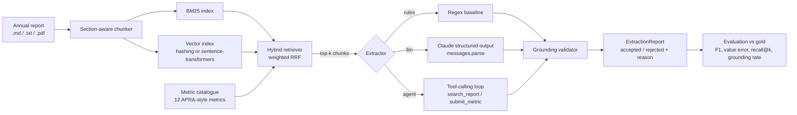

# annual-report-risk-rag

Grounded extraction of prudential risk metrics (CET1, LCR, NSFR, NPL ratio, ECL provisions, VaR, ...)
from bank annual reports, built as a small but complete RAG system: section-aware chunking,
hybrid BM25 + dense retrieval with reciprocal rank fusion, Claude structured-output extraction,
a **grounding validator that refuses any number it cannot trace back to a verbatim sentence**,
an optional tool-calling agent mode, and an evaluation harness with gold labels.

Everything except the live Claude call runs offline and deterministically, so the test suite,
the rule-based baseline and CI need no API key.

## Why this exists

Risk, finance and model-validation teams spend a lot of analyst time pulling the same dozen
numbers out of hundreds of pages of PDF. An LLM can do it in seconds, but a bank cannot use a
number it cannot audit. The design goal here is therefore *not* "extract as much as possible" but
"never accept a value without evidence": every extraction carries the sentence it came from and
the chunk id, and the validator independently checks that (a) the sentence really is in that
chunk, (b) the number really is in that sentence, and (c) the value is plausible for the metric.

## Architecture



Module map:

| Module | Responsibility |
|---|---|
| `report_rag.ingest` | Load Markdown / text / PDF; split on headings; overlapping word windows that never cross a section |
| `report_rag.retrieval.bm25` | Dependency-free BM25 Okapi |
| `report_rag.retrieval.embeddings` | `Embedder` protocol; deterministic `HashingEmbedder`; optional `SentenceTransformerEmbedder` |
| `report_rag.retrieval.hybrid` | Weighted reciprocal rank fusion of sparse and dense legs |
| `report_rag.catalogue` | The metric definitions (id, unit, query, aliases, sanity range) |
| `report_rag.extraction.rules` | Transparent regex baseline; control arm in evaluation |
| `report_rag.extraction.llm_extractor` | Prompt construction + `StructuredLLM` call returning an `ExtractedMetric` |
| `report_rag.extraction.grounding` | Evidence checks and unit normalisation |
| `report_rag.llm` | Provider-neutral protocols, the Anthropic adapter, scripted stubs for tests |
| `report_rag.agent` | Bounded tool-calling agent that drives its own retrieval |
| `report_rag.pipeline` | Orchestration: one retrieval + extraction + validation per metric |
| `report_rag.evaluation` | Gold-label schema, confusion matrix, error metrics, Markdown report |
| `report_rag.cli` | `report-rag metrics | extract | evaluate` |

## Quickstart

```bash
# from the repository root
uv sync --all-packages

# list the catalogue
uv run report-rag metrics

# offline baseline over the two bundled synthetic reports
uv run report-rag extract --extractor rules --report all

# evaluate the baseline against gold labels and write a Markdown report
uv run report-rag evaluate --extractor rules --output projects/annual-report-risk-rag/reports/eval_rules.md

# LLM extraction (needs ANTHROPIC_API_KEY; defaults to claude-opus-5)
export ANTHROPIC_API_KEY=sk-ant-...
uv run report-rag extract --extractor llm --report southern_cross_bank_fy2025 --metric cet1_ratio --metric lcr
uv run report-rag evaluate --extractor llm --output projects/annual-report-risk-rag/reports/eval_llm.md

# agent mode: the model issues its own searches and submits metrics through a tool
uv run report-rag extract --extractor agent --report harbour_mutual_fy2025
```

Configuration is via `REPORT_RAG_*` environment variables or a `.env` file
(see `report_rag.config.Settings`): model, effort, chunk size/overlap, `top_k`, BM25 weight, data dir.

## Data

`data/reports/` holds two **synthetic** annual reports written for this project (a large ADI and a
small mutual). They are deliberately different: the mutual does not disclose LCR/NSFR/leverage or
a trading VaR, which exercises the "not found" path and the true-negative branch of the evaluator.
`data/gold/` holds hand-labelled values, units, periods and the section each value lives in
(used for retrieval recall@k). Nothing here comes from a real bank.

To run on a real report, drop a `.md`/`.txt`/`.pdf` (extra `pdf`) into `data/reports/` and, if
you want scores, a matching `data/gold/<doc_id>.json`.

## Evaluation

`reports/eval_rules.md` is the committed baseline result. The scorer reports, per document:

| Measure | Definition |
|---|---|
| Precision / recall / F1 | Over the confusion matrix where a "positive" is an *accepted* value within tolerance (0.5 % relative or 0.05 absolute) of gold |
| Value accuracy | (TP + TN) / metrics, i.e. including correctly saying "not disclosed" |
| Mean absolute / relative error | Over metrics where both gold and prediction exist |
| Retrieval recall@k | Share of disclosed metrics whose gold section appears in the top-k chunks |
| Grounding rate | Share of `found=true` extractions the validator could fully verify |

The baseline gets micro-F1 0.947 with 100 % precision; its two misses are instructive:
in one report it reads "90" out of "90 or more days past due" for the NPL ratio and the
range check rejects it, in the other it does not recognise the phrasing at all. Those are
exactly the cases a language model is expected to handle, and the harness is built so that an
LLM run can be dropped in as a second column (`--extractor llm`) and compared.

## Design notes

* **Two protocols, not one SDK.** `StructuredLLM` and `ToolCallingLLM` are the only surfaces the
  extractor and the agent depend on. The Anthropic adapter is ~100 lines and is tested with a fake
  client; swapping providers or adding a cache layer does not touch the pipeline.
* **Structured outputs over prompt-parsing.** `messages.parse(output_format=ExtractedMetric)`
  returns a validated Pydantic object; field descriptions in the schema double as instructions.
* **Rank fusion over score interpolation.** BM25 and cosine scores are on different scales;
  RRF needs no calibration and degrades gracefully to pure BM25 when the dense leg is disabled.
* **Agent submissions are not trusted.** The agent can search however it likes, but every
  `submit_metric` goes through the same validator as the RAG path, using only chunks the
  agent actually saw.
* **Cost bounds.** One extraction call per metric with `effort=medium` and `top_k=5` chunks; the
  agent has a hard `max_turns`. Both are configurable.

## Limitations and next steps

* The hashing embedder is a stand-in; install the `dense` extra for a real sentence encoder.
* Tables in PDFs are flattened to text; a layout-aware parser would improve table recall.
* The LLM and agent paths are covered by unit tests with stubs, not by a live evaluation in CI
  (no credentials in CI by design). A `make rag-eval-llm` target that records model, prompt hash
  and cost alongside the metrics is the obvious next addition.
* Period handling is best-effort; multi-year tables are a known weak spot for the baseline.
