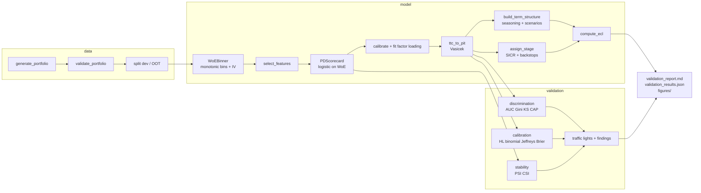

# ifrs9-pd-model

A production-style **IFRS 9 / AASB 9 probability-of-default (PD) model** with an
**independent validation suite** that writes a model-validation report. Everything
runs offline on seeded synthetic data in under ten seconds on a laptop and is
reproducible byte-for-byte.

```bash
uv run ifrs9-pd run-all --output-dir projects/ifrs9-pd-model/reports
```

produces [`reports/validation_report.md`](reports/validation_report.md),
`reports/validation_results.json`, `reports/scorecard.json` and six figures.

## Why this exists

Under IFRS 9 (AASB 9 in Australia) a lender holds **12-month expected credit
losses** (ECL) on performing loans (Stage 1), **lifetime ECL** once credit risk
has increased significantly since origination (SICR, Stage 2), and lifetime ECL
with PD = 1 on credit-impaired loans (Stage 3). That requires more than a
scorecard:

| Component | What it answers | Where |
| --- | --- | --- |
| Behavioural scorecard | Which borrowers are riskier? | `features/binning.py`, `model/scorecard.py` |
| Central-tendency calibration | What is the level of PD through the cycle (TTC)? | `model/calibration.py` |
| Vasicek PIT/TTC overlay | What is the PD *now*, given the economy (PIT)? | `model/calibration.py` |
| Lifetime term structure | How does PD accumulate over the remaining life, per macro scenario? | `model/term_structure.py` |
| SICR staging | Has risk increased significantly since origination? | `model/staging.py` |
| ECL engine | Discounted 12-month vs lifetime loss per loan and per stage | `model/ecl.py` |
| Independent validation | Does it discriminate, is it calibrated, is it stable? | `validation/` |
| Report | What would model risk sign off on? | `reporting/` |

The validation report follows the structure a model-risk function expects
(SR 11-7 conceptual soundness / outcomes analysis / ongoing monitoring; APRA
CPG 223 expectations for provisioning models): executive summary with an
overall RAG rating, data quality, model design, discrimination, calibration,
stability, IFRS 9 components, auto-generated findings, limitations, run metadata.

## Architecture



## Quickstart

```bash
# from the monorepo root (the workspace venv is shared)
uv sync --all-packages
uv run ifrs9-pd run-all --output-dir reports              # end-to-end, prints a RAG summary
uv run ifrs9-pd generate-data --output portfolio.csv --n-loans 20000 --seed 42
uv run ifrs9-pd train --data portfolio.csv --output-dir model
uv run ifrs9-pd validate --data portfolio.csv --model-dir model --output-dir reports
uv run ifrs9-pd show-scorecard --model-dir reports
```

Python API:

```python
from pathlib import Path
from ifrs9_pd.config import PipelineConfig, DataConfig
from ifrs9_pd.pipeline import run_pipeline

results = run_pipeline(PipelineConfig(data=DataConfig(n_loans=20_000, seed=42)), Path("reports"))
print(results.overall_rating, results.samples["oot"].gini)
```

## Module map

```
src/ifrs9_pd/
  config.py                 pydantic configs: Data, Model, Staging, ECL, Scenario, ValidationThresholds
  data/schema.py            column constants (StrEnum) + validate_portfolio()
  data/synthetic.py         seeded retail-mortgage panel with a known latent PD and a 2020 stress
  features/binning.py       WoEBinner: quantile bins -> min-share + monotonic merge, missing bin, IV
  model/scorecard.py        PDScorecard (sklearn logistic on WoE), points scaling, master scale, JSON I/O
  model/calibration.py      intercept calibration, Vasicek ttc_to_pit / pit_to_ttc, factor-loading fit
  model/term_structure.py   monthly hazards, age-aware seasoning, scenario z-paths, weighted curves
  model/staging.py          Stage 1/2/3 with relative + absolute PD tests and dpd backstops
  model/ecl.py              discount factors, amortising EAD profile, ECL by stage, portfolio summary
  validation/discrimination.py   AUC, Gini, KS, bootstrap CI, CAP, rank ordering
  validation/calibration.py      Hosmer-Lemeshow, binomial and Jeffreys by grade, Brier
  validation/stability.py        PSI (score) and CSI (features)
  validation/backtest.py         dev-vs-OOT comparison
  validation/thresholds.py       traffic lights
  reporting/figures.py      matplotlib (Agg) PNGs
  reporting/report.py       Markdown report writer (no timestamps -> reproducible)
  results.py                ValidationResults pydantic container, deterministic JSON
  pipeline.py               run_pipeline(): orchestrates everything above
  cli.py                    typer CLI `ifrs9-pd`
```

## Validation methodology

| Test | What it checks | Thresholds (green / amber / red) | Reference |
| --- | --- | --- | --- |
| AUC / Gini with bootstrap CI | Rank-ordering power on dev and out-of-time | >= 0.50 / 0.40-0.50 / < 0.40 | Basel WP14 (2005), §III |
| KS statistic | Maximum separation of good/bad score CDFs | >= 0.30 / 0.20-0.30 / < 0.20 | Basel WP14 |
| CAP / accuracy ratio | Same information as Gini, reported for completeness | as Gini | Basel WP14 |
| Rank ordering by grade | Observed default rate non-decreasing across master-scale grades | monotonic / not | Basel WP14, SR 11-7 outcomes analysis |
| Gini deterioration dev -> OOT | Stability of discrimination over time | < 0.05 / 0.05-0.10 / > 0.10 | SR 11-7 ongoing monitoring |
| Hosmer-Lemeshow | Calibration across PD deciles | p >= 0.05 / 0.01-0.05 / < 0.01 | Basel WP14, §IV |
| Binomial test (portfolio and by grade) | Observed vs predicted default counts | p >= 0.05 / 0.01-0.05 / < 0.01 | Basel WP14 |
| Jeffreys test by grade | Bayesian under-estimation check, Beta(d+1/2, n-d+1/2) | p reported | ECB TRIM guide (2019) |
| PD / observed DR | Conservatism of the level | >= 0.85 / 0.70-0.85 / < 0.70 | APRA CPG 223 |
| Score PSI | Population shift dev -> OOT | < 0.10 / 0.10-0.25 / > 0.25 | industry rule of thumb |
| CSI per feature | Input distribution shift | as PSI | industry rule of thumb |
| Scenario sensitivity | ECL under each scenario vs probability-weighted | reported | IFRS 9 B5.5.42 (non-linearity) |

Thresholds live in `config.ValidationThresholds` with the rationale in the
docstring. Each amber or red result becomes a finding with a severity (high for
red core metrics, medium for amber core or red secondary, low otherwise); the
overall rating is red if any high-severity finding exists.

The formulas (WoE/IV, points scaling, Vasicek, hazards, ECL, PSI, HL, Jeffreys)
are in [`docs/METHODOLOGY.md`](docs/METHODOLOGY.md).

## What the committed report says (seed 42, 20,000 loans)

| | Development | Out-of-time |
| --- | --- | --- |
| Rows (performing) / defaults | 11,966 / 330 | 7,982 / 135 |
| Gini [95% bootstrap CI] | 0.739 [0.702, 0.774] | 0.723 [0.665, 0.778] |
| KS | 0.593 | 0.577 |
| Hosmer-Lemeshow p-value | 0.166 | 0.003 |
| Mean PIT PD / observed DR | 1.00 | 0.76 |
| Score PSI dev -> OOT | | 0.004 |

Reporting book (8,010 loans, EAD $3.77bn): Stage 1 94.0% / Stage 2 5.6% /
Stage 3 0.3% of loans; probability-weighted ECL $38.6m, coverage 1.02%
(Stage 1 0.47%, Stage 2 8.2%, Stage 3 35%); downside scenario ECL +61%,
upside -37% versus weighted.

**Overall rating: RED.** Discrimination and stability are green, but the model
under-predicts in the benign out-of-time window (PD/DR 0.76, HL p = 0.003).
This is the honest outcome for this seed: the development window realises
about 6% fewer defaults than its latent PD, and the maximum-likelihood factor
loading absorbs part of the 2020 stress, so the calibrated level is low once the
economy normalises. The suite turns that into a high-severity finding with a
recalibration recommendation, which is exactly what it is for. With other seeds
(for example `--seed 7` or `--seed 123`) the same code rates green with no
findings (OOT Gini 0.67 / 0.69, PD/DR 1.03 / 1.07).

## Design decisions worth knowing

- **Scorecard vs overlay.** The scorecard ranks borrowers on their own
  characteristics and behaviour (including loan age); the macro effect enters only
  through the Vasicek overlay, so PIT and TTC PDs are both available.
- **Factor loading is estimated, not assumed.** A standardised macro proxy has
  unit variance by construction, which need not match the latent Vasicek factor.
  The loading is fitted by maximum likelihood jointly with the intercept shift.
- **Age-matched origination PD.** The SICR comparison resets delinquency and
  macro to origination values but keeps the loan's current age, so the expected
  seasoning hump does not push every loan into Stage 2.
- **Annual-horizon Vasicek in the term structure.** The transform is applied to
  the 12-month PD at each future month and then converted to a monthly hazard;
  applying it directly to monthly hazards would overstate factor sensitivity.
- **Deterministic artefacts.** No timestamps; floats rounded to 6 dp in JSON;
  seeded bootstrap; matplotlib metadata stripped. `test_pipeline_determinism.py`
  asserts byte equality.

## Limitations

- Synthetic data: the true PD is a known Vasicek-logistic function, so real-world
  non-linearities, data-quality problems and default-definition changes are absent.
- LGD is a flat (or per-region) input and EAD amortises linearly; no LGD/EAD
  models are built or validated.
- One macro proxy (unemployment gap) with an assumed asset correlation; no
  macro-econometric model, judgemental scenario shifts, lifetime truncated at the
  60-month horizon rather than contractual maturity.
- The calibration anchor is the development-window default rate, a short proxy
  for a through-the-cycle rate.

## Extending to real data

Provide a CSV with the columns in `data/schema.py::REQUIRED_COLUMNS`
(`loan_id`, `origination_date`, `snapshot_date`, the numeric and categorical
features, `macro_unemployment_rate`, `macro_unemployment_at_origination`,
`exposure_at_default`, `remaining_term_months`, `default_12m`), then
`ifrs9-pd train` / `ifrs9-pd validate`. `validate_portfolio` will name the
first column that fails a type or range check. Replace
`macro_unemployment_series()` with your own monthly series when building the
`FittedModel`, and set `ECLConfig.lgd_by_segment` for segment-level LGDs.

## Development

```bash
uv run ruff check projects/ifrs9-pd-model && uv run ruff format --check projects/ifrs9-pd-model
uv run mypy -p ifrs9_pd
uv run pytest projects/ifrs9-pd-model/tests -q --cov=ifrs9_pd
```
