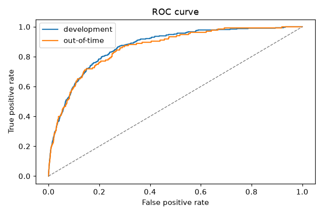
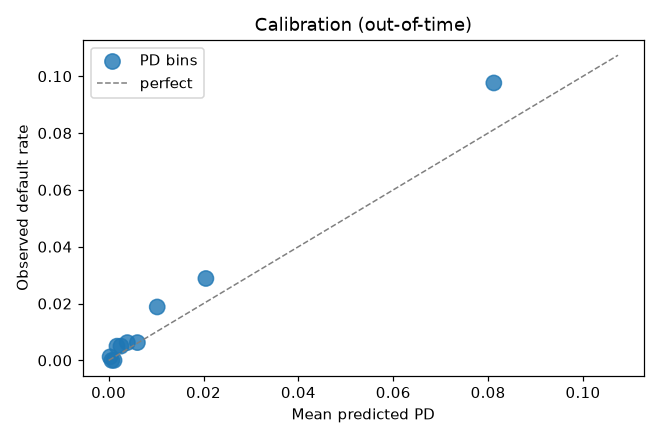
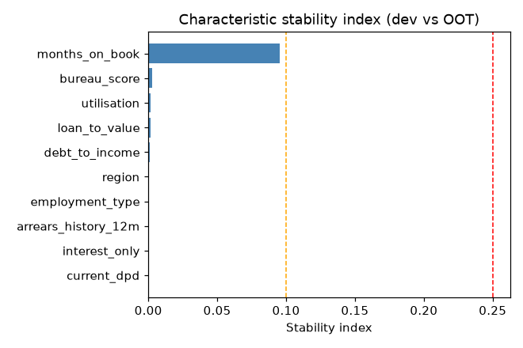
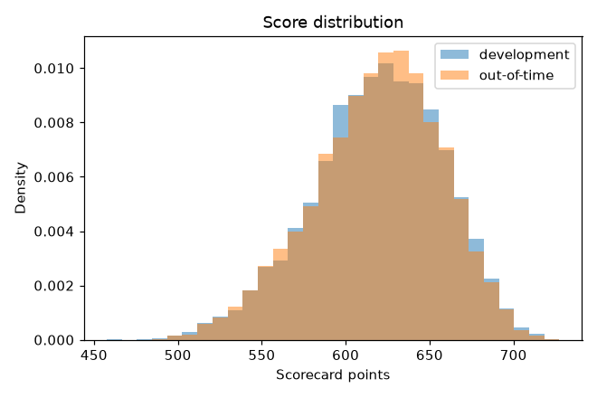
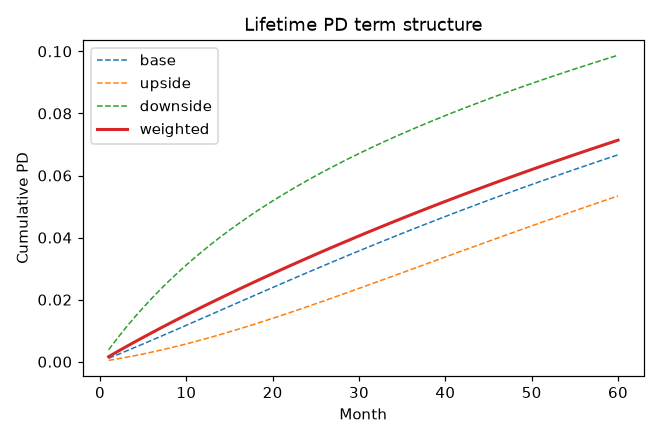
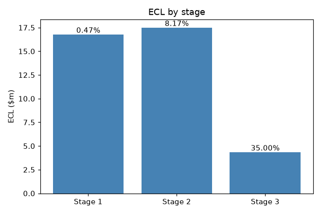

# IFRS 9 PD model - independent validation report


## 1. Executive summary

**Overall rating: 🔴 RED**

| Metric | Development | Out-of-time | Rating |
| --- | --- | --- | --- |
| Gini (95% CI) | 0.739 [0.702, 0.774] | 0.723 [0.665, 0.778] | 🟢 GREEN |
| KS | 0.593 | 0.577 | 🟢 GREEN |
| Hosmer-Lemeshow p-value | 0.166 | 0.003 | 🔴 RED |
| Mean PD / observed DR | 1.00 | 0.76 | 🟠 AMBER |
| Score PSI (dev vs OOT) | - | 0.004 | 🟢 GREEN |
| Gini deterioration | - | 0.017 | 🟢 GREEN |

**Key findings**

- [HIGH] Hosmer-Lemeshow p-value of 0.003 on the oot sample indicates miscalibration across PD deciles.
- [MEDIUM] Portfolio-level binomial test p-value of 0.002 on the oot sample: predicted and observed default rates differ significantly.
- [LOW] Mean PD is 0.76x the observed default rate on the oot sample (PD underestimates realised defaults).

The reporting book holds 8,010 loans with EAD of 3,773,730,078 and probability-weighted ECL of 38,591,337 (coverage 1.02%).

## 2. Model overview and scope

**Purpose.** 12-month and lifetime probability of default for a retail residential-mortgage portfolio, used for IFRS 9 / AASB 9 stage allocation and expected-credit-loss measurement.

**Portfolio and data.** Synthetic loan-snapshot panel with 20,000 rows observed between 2017-01 and 2023-12; each row carries a 12-month default flag. Development sample: snapshots up to 2022-06; out-of-time (OOT) sample: later snapshots. Defaulted loans (90+ days past due) are excluded from scorecard development and validation but included in the reporting book for staging and ECL.

**Methodology.**

1. Weight-of-evidence binning with monotonic merging and a separate missing bin; feature selection by information value (IV >= 0.02).
2. L2-regularised logistic regression on WoE features, scaled to points (PDO 20, 600 points at 50:1 odds).
3. Central-tendency calibration to the development-window default rate, imposed on PIT PDs, with the factor loading of the macro proxy estimated by maximum likelihood.
4. Vasicek PIT/TTC conversion with asset correlation rho = 0.15 and a systematic factor proxied by the standardised unemployment gap.
5. Lifetime term structure over 60 months with an age-aware seasoning hump and probability-weighted macro scenarios; SICR staging with relative and absolute PD tests and a 30-dpd backstop; discounted ECL.

The validation follows the SR 11-7 pillars of conceptual soundness, ongoing monitoring and outcomes analysis, and the APRA CPG 223 expectations for independent review of IFRS 9 provisioning models.

## 3. Data quality

| Sample | Rows | Performing rows | Default rate |
| --- | --- | --- | --- |
| Total | 20,000 | - | 2.40% |
| Development (<= 2022-06) | 11,990 | 11,966 | 2.82% |
| Out-of-time (> 2022-06) | 8,010 | 7,982 | 1.79% |

**Default rate by snapshot year**

| year | n | default_rate |
| --- | --- | --- |
| 2017 | 468 | 0.64% |
| 2018 | 1163 | 1.29% |
| 2019 | 1963 | 1.43% |
| 2020 | 2700 | 5.30% |
| 2021 | 3623 | 2.70% |
| 2022 | 4289 | 1.82% |
| 2023 | 5794 | 2.00% |

**Missing values** (features without missing values omitted)

| feature | missing_rate |
| --- | --- |
| bureau_score | 1.51% |
| debt_to_income | 1.49% |

## 4. Model design

**Information value ranking** (selected features in bold)

| feature | kind | n_bins | iv |
| --- | --- | --- | --- |
| **bureau_score** | numeric | 9 | 1.3490 |
| **arrears_history_12m** | numeric | 2 | 0.4918 |
| **loan_to_value** | numeric | 6 | 0.1231 |
| **debt_to_income** | numeric | 7 | 0.1000 |
| **current_dpd** | numeric | 2 | 0.0907 |
| **employment_type** | categorical | 5 | 0.0655 |
| **months_on_book** | numeric | 5 | 0.0525 |
| **utilisation** | numeric | 8 | 0.0382 |
| interest_only | categorical | 2 | 0.0065 |
| region | categorical | 6 | 0.0058 |

**Coefficients**

| term | coefficient |
| --- | --- |
| bureau_score | -0.9040 |
| arrears_history_12m | -0.5091 |
| loan_to_value | -0.9958 |
| debt_to_income | -1.0401 |
| current_dpd | -0.4563 |
| employment_type | -1.0068 |
| months_on_book | -0.8806 |
| utilisation | -0.9755 |
| intercept | -3.5529 |
| calibration_shift | -0.1314 |
| factor_loading | 0.5038 |

Calibration shift on the logit scale: -0.1314 (anchor default rate 2.76%); Vasicek asset correlation 0.15 with fitted factor loading 0.504.

**Scorecard** (points per bin)

| feature | bin | count | event_rate | woe | points |
| --- | --- | --- | --- | --- | --- |
| bureau_score | (-inf, 587] | 1190 | 12.77% | -1.6298 | 31.7 |
| bureau_score | (587, 623] | 1200 | 4.83% | -0.5762 | 59.1 |
| bureau_score | (623, 647] | 1186 | 2.95% | -0.0689 | 72.4 |
| bureau_score | (647, 668] | 1148 | 2.26% | 0.1980 | 79.3 |
| bureau_score | (668, 688] | 1179 | 1.78% | 0.4387 | 85.6 |
| bureau_score | (688, 708] | 1169 | 0.94% | 1.0644 | 101.9 |
| bureau_score | (708, 756] | 2362 | 0.72% | 1.3499 | 109.4 |
| bureau_score | (756, 792.1] | 1168 | 0.34% | 2.0078 | 126.5 |
| bureau_score | (792.1, inf] | 1178 | 0.17% | 2.6059 | 142.1 |
| bureau_score | missing | 186 | 2.15% | 0.1545 | 78.2 |
| arrears_history_12m | (-inf, 0] | 10906 | 1.96% | 0.3492 | 79.3 |
| arrears_history_12m | (0, inf] | 1060 | 10.94% | -1.4671 | 52.6 |
| loan_to_value | (-inf, 0.5481] | 1198 | 1.34% | 0.7181 | 94.8 |
| loan_to_value | (0.5481, 0.6098] | 1199 | 1.42% | 0.6592 | 93.1 |
| loan_to_value | (0.6098, 0.655] | 1193 | 1.93% | 0.3542 | 84.4 |
| loan_to_value | (0.655, 0.6929] | 1199 | 2.17% | 0.2366 | 81.0 |
| loan_to_value | (0.6929, 0.7587] | 2392 | 3.14% | -0.1299 | 70.4 |
| loan_to_value | (0.7587, inf] | 4785 | 3.62% | -0.2736 | 66.3 |
| debt_to_income | (-inf, 2.85] | 1179 | 1.53% | 0.5886 | 91.8 |
| debt_to_income | (2.85, 3.336] | 1180 | 1.95% | 0.3460 | 84.6 |
| debt_to_income | (3.336, 3.736] | 1179 | 1.95% | 0.3451 | 84.5 |
| debt_to_income | (3.736, 4.109] | 1183 | 2.11% | 0.2651 | 82.1 |
| debt_to_income | (4.109, 6.039] | 4712 | 2.95% | -0.0611 | 72.3 |
| debt_to_income | (6.039, 7.035] | 1177 | 3.74% | -0.3135 | 64.8 |
| debt_to_income | (7.035, inf] | 1179 | 4.58% | -0.5233 | 58.5 |
| debt_to_income | missing | 177 | 2.26% | 0.1010 | 77.2 |
| current_dpd | (-inf, 0] | 11735 | 2.60% | 0.0623 | 75.0 |
| current_dpd | (0, inf] | 231 | 10.82% | -1.4682 | 54.8 |
| employment_type | self_employed | 1432 | 4.61% | -0.5326 | 58.7 |
| employment_type | casual | 929 | 3.34% | -0.2047 | 68.2 |
| employment_type | part_time | 1842 | 2.77% | -0.0062 | 74.0 |
| employment_type | retired | 580 | 2.59% | 0.0414 | 75.4 |
| employment_type | full_time | 7183 | 2.32% | 0.1796 | 79.4 |
| months_on_book | (-inf, 6] | 2526 | 2.02% | 0.3172 | 82.2 |
| months_on_book | (6, 14] | 2420 | 2.36% | 0.1607 | 78.3 |
| months_on_book | (14, 18] | 1053 | 2.37% | 0.1417 | 77.8 |
| months_on_book | (18, 24] | 1376 | 2.54% | 0.0766 | 76.1 |
| months_on_book | (24, inf] | 4591 | 3.53% | -0.2501 | 67.8 |
| utilisation | (-inf, 0.1455] | 1199 | 1.92% | 0.3622 | 84.4 |
| utilisation | (0.1455, 0.2134] | 1195 | 2.43% | 0.1263 | 77.7 |
| utilisation | (0.2134, 0.3833] | 3590 | 2.53% | 0.0930 | 76.8 |
| utilisation | (0.3833, 0.4423] | 1197 | 2.59% | 0.0607 | 75.9 |
| utilisation | (0.4423, 0.5074] | 1197 | 2.59% | 0.0607 | 75.9 |
| utilisation | (0.5074, 0.5807] | 1196 | 3.09% | -0.1197 | 70.8 |
| utilisation | (0.5807, 0.6789] | 1197 | 3.51% | -0.2483 | 67.2 |
| utilisation | (0.6789, inf] | 1195 | 3.85% | -0.3434 | 64.5 |

**Master scale** (geometric PD bands)

| grade | pd_lower | pd_upper | pd_mid |
| --- | --- | --- | --- |
| 1 | 0.00% | 0.03% | 0.01% |
| 2 | 0.03% | 0.07% | 0.05% |
| 3 | 0.07% | 0.17% | 0.11% |
| 4 | 0.17% | 0.40% | 0.26% |
| 5 | 0.40% | 0.95% | 0.62% |
| 6 | 0.95% | 2.25% | 1.46% |
| 7 | 2.25% | 5.33% | 3.46% |
| 8 | 5.33% | 12.65% | 8.22% |
| 9 | 12.65% | 30.00% | 19.48% |
| 10 | 30.00% | 100.00% | 54.77% |

## 5. Discrimination

| Metric | Development | Out-of-time |
| --- | --- | --- |
| AUC | 0.8697 | 0.8614 |
| Gini (bootstrap 95% CI) | 0.7393 [0.7018, 0.7737] | 0.7228 [0.6649, 0.7778] |
| KS (bootstrap 95% CI) | 0.5930 [0.5601, 0.6405] | 0.5771 [0.5262, 0.6527] |
| CAP accuracy ratio | 0.7393 | 0.7228 |
| Rank ordering monotonic | yes | yes |

Gini deterioration from development to OOT: 0.0166 (🟢 GREEN).



**Rank ordering by grade (out-of-time)**

| grade | n | defaults | default_rate |
| --- | --- | --- | --- |
| 1 | 378 | 0 | 0.00% |
| 2 | 890 | 1 | 0.11% |
| 3 | 1461 | 2 | 0.14% |
| 4 | 1703 | 10 | 0.59% |
| 5 | 1470 | 12 | 0.82% |
| 6 | 1007 | 22 | 2.18% |
| 7 | 618 | 31 | 5.02% |
| 8 | 329 | 30 | 9.12% |
| 9 | 115 | 24 | 20.87% |
| 10 | 11 | 3 | 27.27% |

## 6. Calibration

| Metric | Development | Out-of-time |
| --- | --- | --- |
| Mean PIT PD | 2.7578% | 1.2849% |
| Observed default rate | 2.7578% | 1.6913% |
| PD / DR ratio | 1.000 | 0.760 |
| Binomial p-value (portfolio) | 1.000 | 0.002 |
| Hosmer-Lemeshow statistic | 11.684 | 22.974 |
| Hosmer-Lemeshow p-value | 0.166 | 0.003 |
| Brier score | 0.02400 | 0.01549 |



**Calibration by PD decile (out-of-time)**

| bin | n | defaults | mean_pd | observed_rate |
| --- | --- | --- | --- | --- |
| 1 | 799 | 1 | 0.03% | 0.13% |
| 2 | 798 | 0 | 0.07% | 0.00% |
| 3 | 798 | 0 | 0.11% | 0.00% |
| 4 | 798 | 4 | 0.18% | 0.50% |
| 5 | 798 | 4 | 0.26% | 0.50% |
| 6 | 798 | 5 | 0.39% | 0.63% |
| 7 | 798 | 5 | 0.61% | 0.63% |
| 8 | 798 | 15 | 1.02% | 1.88% |
| 9 | 798 | 23 | 2.05% | 2.88% |
| 10 | 799 | 78 | 8.12% | 9.76% |

**Binomial test by grade (oot)**

| grade | n | defaults | predicted_pd | observed_rate | p_value |
| --- | --- | --- | --- | --- | --- |
| 1 | 378 | 0 | 0.02% | 0.00% | 1.000 |
| 2 | 890 | 1 | 0.05% | 0.11% | 0.360 |
| 3 | 1461 | 2 | 0.12% | 0.14% | 0.688 |
| 4 | 1703 | 10 | 0.27% | 0.59% | 0.018 |
| 5 | 1470 | 12 | 0.62% | 0.82% | 0.315 |
| 6 | 1007 | 22 | 1.45% | 2.18% | 0.062 |
| 7 | 618 | 31 | 3.45% | 5.02% | 0.046 |
| 8 | 329 | 30 | 7.92% | 9.12% | 0.414 |
| 9 | 115 | 24 | 18.34% | 20.87% | 0.470 |
| 10 | 11 | 3 | 33.51% | 27.27% | 0.761 |

**Jeffreys test by grade (oot)** - p-value is P(DR <= PD); small values flag underestimation

| grade | n | defaults | predicted_pd | observed_rate | p_value |
| --- | --- | --- | --- | --- | --- |
| 1 | 378 | 0 | 0.02% | 0.00% | 0.303 |
| 2 | 890 | 1 | 0.05% | 0.11% | 0.173 |
| 3 | 1461 | 2 | 0.12% | 0.14% | 0.359 |
| 4 | 1703 | 10 | 0.27% | 0.59% | 0.011 |
| 5 | 1470 | 12 | 0.62% | 0.82% | 0.165 |
| 6 | 1007 | 22 | 1.45% | 2.18% | 0.031 |
| 7 | 618 | 31 | 3.45% | 5.02% | 0.021 |
| 8 | 329 | 30 | 7.92% | 9.12% | 0.208 |
| 9 | 115 | 24 | 18.34% | 20.87% | 0.237 |
| 10 | 11 | 3 | 33.51% | 27.27% | 0.657 |

## 7. Stability

Score PSI (development vs out-of-time): **0.0037** (🟢 GREEN).

| bin | expected_share | actual_share | contribution |
| --- | --- | --- | --- |
| (-inf, 566.9] | 10.00% | 10.26% | 0.0001 |
| (566.9, 587.4] | 10.00% | 9.97% | 0.0000 |
| (587.4, 599.9] | 9.99% | 9.21% | 0.0006 |
| (599.9, 610.9] | 10.03% | 9.85% | 0.0000 |
| (610.9, 621.2] | 9.97% | 10.26% | 0.0001 |
| (621.2, 631.3] | 10.00% | 10.59% | 0.0003 |
| (631.3, 641.9] | 9.99% | 11.18% | 0.0013 |
| (641.9, 653] | 10.00% | 9.43% | 0.0003 |
| (653, 667.8] | 9.99% | 10.16% | 0.0000 |
| (667.8, inf] | 10.00% | 9.10% | 0.0009 |

**Characteristic stability index per feature**

| feature | kind | csi | rating |
| --- | --- | --- | --- |
| months_on_book | numeric | 0.0955 | 🟢 GREEN |
| bureau_score | numeric | 0.0025 | 🟢 GREEN |
| utilisation | numeric | 0.0019 | 🟢 GREEN |
| loan_to_value | numeric | 0.0014 | 🟢 GREEN |
| debt_to_income | numeric | 0.0012 | 🟢 GREEN |
| region | categorical | 0.0004 | 🟢 GREEN |
| employment_type | categorical | 0.0003 | 🟢 GREEN |
| arrears_history_12m | numeric | 0.0002 | 🟢 GREEN |
| interest_only | categorical | 0.0001 | 🟢 GREEN |
| current_dpd | numeric | 0.0000 | 🟢 GREEN |





## 8. IFRS 9 components

**PIT / TTC** (reporting book)

| Quantity | Value |
| --- | --- |
| Loans | 8,010 |
| Mean systematic factor z at snapshot | 0.426 |
| Mean 12m TTC PD | 2.4437% |
| Mean 12m PIT PD | 1.3000% |
| Mean 12m PIT PD at origination (age-matched) | 1.8073% |
| Scenario-weighted 12m PD | 1.7886% |
| Scenario-weighted lifetime PD | 7.1375% |

The gap between the TTC PD and the scenario-weighted 12m PD is the non-linearity effect of the discrete scenario set; a large gap would indicate that the scenarios do not span the factor distribution.



**Average cumulative PD by month**

| month | base | upside | downside | weighted |
| --- | --- | --- | --- | --- |
| 1 | 0.11% | 0.04% | 0.39% | 0.16% |
| 6 | 0.69% | 0.31% | 2.04% | 0.94% |
| 12 | 1.42% | 0.72% | 3.59% | 1.79% |
| 24 | 2.87% | 1.77% | 5.84% | 3.34% |
| 36 | 4.25% | 2.97% | 7.47% | 4.73% |
| 48 | 5.51% | 4.18% | 8.77% | 5.99% |
| 60 | 6.67% | 5.34% | 9.88% | 7.14% |

**Stage distribution**

| stage | n_loans | ead | share_of_loans | share_of_ead |
| --- | --- | --- | --- | --- |
| 1 | 7530 | 3,547,298,156 | 94.01% | 94.00% |
| 2 | 452 | 214,047,206 | 5.64% | 5.67% |
| 3 | 28 | 12,384,716 | 0.35% | 0.33% |

**ECL by stage**

| stage | n_loans | ead | ecl | coverage | share_of_ead |
| --- | --- | --- | --- | --- | --- |
| 1 | 7530 | 3,547,298,156 | 16,769,609 | 0.47% | 94.00% |
| 2 | 452 | 214,047,206 | 17,487,077 | 8.17% | 5.67% |
| 3 | 28 | 12,384,716 | 4,334,651 | 35.00% | 0.33% |
| total | 8010 | 3,773,730,078 | 38,591,337 | 1.02% | 100.00% |



**Scenario sensitivity**

| scenario | weight | z_shift | mean_pd_12m | mean_pd_lifetime | ecl | ecl_vs_weighted |
| --- | --- | --- | --- | --- | --- | --- |
| base | 0.50 | 0.00 | 1.42% | 6.67% | 33,940,785 | -12.1% |
| upside | 0.25 | 1.00 | 0.72% | 5.34% | 24,431,917 | -36.7% |
| downside | 0.25 | -1.50 | 3.59% | 9.88% | 62,051,863 | +60.8% |
| weighted | 1.00 | - | 1.79% | 7.14% | 38,591,337 | +0.0% |

## 9. Findings and recommendations

| severity | metric | value | rating | message |
| --- | --- | --- | --- | --- |
| high | oot_hl_p_value | 0.0034 | red | Hosmer-Lemeshow p-value of 0.003 on the oot sample indicates miscalibration across PD deciles. |
| medium | oot_binomial_p_value | 0.0020 | red | Portfolio-level binomial test p-value of 0.002 on the oot sample: predicted and observed default rates differ significantly. |
| low | oot_pd_to_dr_ratio | 0.7597 | amber | Mean PD is 0.76x the observed default rate on the oot sample (PD underestimates realised defaults). |

Recommendations: high-severity findings block approval until remediated; medium findings require a documented action plan before the next monitoring cycle; low findings are noted for monitoring.

**Traffic lights**

| test | rating |
| --- | --- |
| dev_gini | 🟢 GREEN |
| dev_ks | 🟢 GREEN |
| dev_hl_p_value | 🟢 GREEN |
| dev_binomial_p_value | 🟢 GREEN |
| dev_pd_to_dr_ratio | 🟢 GREEN |
| dev_rank_ordering | 🟢 GREEN |
| oot_gini | 🟢 GREEN |
| oot_ks | 🟢 GREEN |
| oot_hl_p_value | 🔴 RED |
| oot_binomial_p_value | 🔴 RED |
| oot_pd_to_dr_ratio | 🟠 AMBER |
| oot_rank_ordering | 🟢 GREEN |
| gini_deterioration | 🟢 GREEN |
| score_psi | 🟢 GREEN |
| csi_months_on_book | 🟢 GREEN |
| csi_bureau_score | 🟢 GREEN |
| csi_utilisation | 🟢 GREEN |
| csi_loan_to_value | 🟢 GREEN |
| csi_debt_to_income | 🟢 GREEN |
| csi_region | 🟢 GREEN |
| csi_employment_type | 🟢 GREEN |
| csi_arrears_history_12m | 🟢 GREEN |
| csi_interest_only | 🟢 GREEN |
| csi_current_dpd | 🟢 GREEN |

## 10. Limitations and model risk

- The data are synthetic: the true PD is a known function of the drivers, so real-world non-linearities, data-quality issues and definition changes are absent.
- LGD is a flat (or region-level) assumption and EAD amortises linearly; no LGD or EAD models are validated.
- The systematic factor is a single unemployment-based proxy with an assumed asset correlation; no macro-econometric model is fitted and scenario shifts are judgemental.
- The origination PD used for SICR is reconstructed by re-scoring with delinquency fields reset and the current loan age kept, rather than retrieved from an origination archive.
- Lifetime is truncated at the term-structure horizon rather than the full contractual term.
- The calibration anchor is the development-window average default rate, which is a short proxy for a through-the-cycle rate.

## 11. Appendix: run metadata

- Package: `ifrs9_pd` version 0.1.0
- Generated deterministically with seed 42; no wall-clock timestamp is embedded.
- Metrics: `validation_results.json`; model artefact: `scorecard.json`.

**Configuration**

```json
{
  "data": {
    "dev_cutoff": "2022-06",
    "last_snapshot": "2023-12",
    "missing_rate": 0.015,
    "n_loans": 20000,
    "origination_end": "2023-12",
    "origination_start": "2017-01",
    "seed": 42,
    "target_default_rate": 0.025
  },
  "ecl": {
    "discount_rate": 0.05,
    "horizon_months": 60,
    "lgd": 0.35,
    "lgd_by_segment": {},
    "mean_reversion": 0.05,
    "peak_month": 24,
    "peak_multiplier": 1.4
  },
  "model": {
    "asset_correlation": 0.15,
    "base_odds": 50.0,
    "base_score": 600.0,
    "grade_max_pd": 0.3,
    "grade_min_pd": 0.0003,
    "max_iv": null,
    "min_bin_share": 0.01,
    "min_iv": 0.02,
    "n_bins": 10,
    "n_grades": 10,
    "pdo": 20.0,
    "regularisation_c": 1.0
  },
  "scenarios": {
    "weights": {
      "base": 0.5,
      "downside": 0.25,
      "upside": 0.25
    },
    "z_shifts": {
      "base": 0.0,
      "downside": -1.5,
      "upside": 1.0
    }
  },
  "staging": {
    "absolute_pd_threshold_bps": 50.0,
    "default_dpd": 90,
    "dpd_backstop": 30,
    "relative_pd_threshold": 2.0
  },
  "thresholds": {
    "binomial_p_value": {
      "amber": 0.01,
      "green": 0.05,
      "higher_is_better": true
    },
    "gini": {
      "amber": 0.4,
      "green": 0.5,
      "higher_is_better": true
    },
    "gini_deterioration": {
      "amber": 0.1,
      "green": 0.05,
      "higher_is_better": false
    },
    "hl_p_value": {
      "amber": 0.01,
      "green": 0.05,
      "higher_is_better": true
    },
    "ks": {
      "amber": 0.2,
      "green": 0.3,
      "higher_is_better": true
    },
    "pd_to_dr_ratio": {
      "amber": 0.7,
      "green": 0.85,
      "higher_is_better": true
    },
    "psi": {
      "amber": 0.25,
      "green": 0.1,
      "higher_is_better": false
    }
  }
}
```
